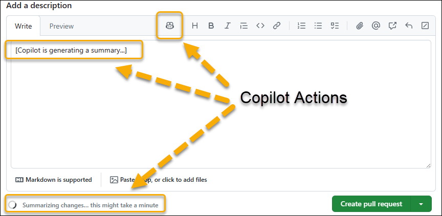
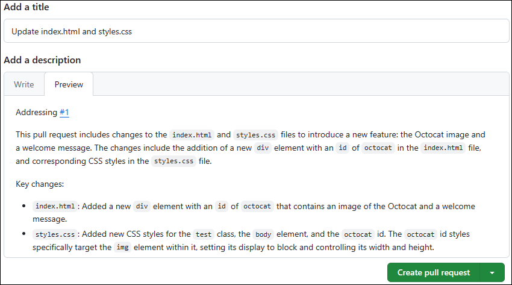

---
lab:
    title: 'Implement Flow of Work with GitHub'
    module: 'Develop with DevOps'
---

# Lab 02 - Implement Flow of Work with GitHub

## Estimated timing: 30 minutes

## Scenario

Remember this module’s scenario in which you’re working for a software development company in the retail industry that is planning to migrate an online store from an old app to a new app called eShopOnWeb. Since you have decided to use Git and GitHub to facilitate application lifecycle management, this lab gives you the opportunity to start by forking an existing repo, configuring it, creating an issue, creating a branch, updating files in the branch, creating and merging a pull request, closing the issue and validating the changes.

## Objectives

In this lab, you will:

- Implement and manage repos with GitHub

> **Note:** For this and subsequent labs, use the same GitHub account you created for the purpose of the first lab.

## Prerequisites

- Completed [Lab 01 - Agile Planning and Management using GitHub](01-agile-planning-management-using-github.md)

## Exercise 1: Implement and manage repos with GitHub

In this exercise, you'll fork a Git repo and manage it by using GitHub.

> **Important:** The GitHub Copilot for pull request feature usage is completely optional. To use this feature, you must be a member of an enterprise with a **Copilot Enterprise subscription**. You can skip the steps that involve the GitHub Copilot for pull request feature if you don't have access to it. If you want to know more about the GitHub Copilot for pull request feature, refer to [About Copilot pull request summaries](https://docs.github.com/en/enterprise-cloud@latest/copilot/github-copilot-enterprise/copilot-pull-request-summaries/about-copilot-pull-request-summaries).

> **Note:** You created a new repo in the first lab of our course. In this lab, you will start by forking an existing repo. A fork is a repository that shares code and visibility settings with an existing upstream repository. This approach is frequently used when developing updates to open-source projects or in scenarios where write access to the upstream repository is not available. For more information, refer to [Working with forks](https://docs.github.com/en/pull-requests/collaborating-with-pull-requests/working-with-forks).

The exercise consists of the following tasks:

- Task 1: Fork a GitHub repo
- Task 2: Configure a GitHub repo
- Task 3: Create an issue
- Task 4: Create a branch
- Task 5: Update files in the branch
- Task 6: Create and merge a pull request
- Task 7: Close the issue
- Task 8: Validate the changes

### Task 1: Fork a GitHub repo

1. Start a web browser and navigate to the [GitHub](https://github.com) home page.
1. When prompted to authenticate, sign in by using your GitHub user account.
1. Open another tab in the same browser window and navigate to the [Spoon-Knife](https://github.com/octocat/Spoon-Knife) repo.
1. On the **Spoon-Knife** repo page, select **Fork**.
1. On the **Create a new fork** page, ensure that the **Owner** drop-down list entry displays your GitHub user name, accept the default entry **Spoon-Knife** in the **Repository name** text box, leave the **Copy the main branch only** checkbox enabled, and then select **Create fork**.

   > **Note:** Your browser session will be automatically redirected to the newly forked repo.

### Task 2: Configure a GitHub repo

1. On the forked **Spoon-Knife** repo page, in the toolbar, select **Settings**.
1. In the **General** section of the **Settings** tab, note that the default branch is set to **main*.
1. Navigate to the **Features** area of the **General** section and enable the **Issues** checkbox.
1. In the left side navigational menu, in the **Code and automation** grouping, select the **Pages** entry.
1. In the **GitHub Pages** pane, in the Branch section, change the **None** entry in the drop-down list to **main** and then select **Save**.

   > **Note:** GitHub Pages will automatically publish the content of the repo to a site accessible via the URL `https://<your_GitHub_username>.github.io/Spoon-Knife/`.

1. In the **GitHub Pages** pane, select the **Visit site** button. This will automatically open another web browser tab and display the page representing the current content of the index.html file.

   > **Note:** You might need to wait a few minutes before the **Visit site** button and the page become available.

   > **Note:** Perform the remaining steps of this task if you completed the first lab.

1. Back on the forked **Spoon-Knife** repo page, in the toolbar, select **Projects**.
1. On the **Welcome to the all-new projects** pane, select **Link a project**, and, in the drop-down menu, select **Link an existing project**.
1. In the list of the existing projects, select **DevOps Core Intro Project**.

### Task 3: Create an issue

1. On the forked **Spoon-Knife** page, select the **Issues** tab.
1. On the **Welcome to issues!** page, select **New issue**.
1. In the **Add a title** text box, enter **index.html looks rather austere**.
1. In the **Add a description** text box, enter **index.html file can use a modern touch**.
1. In the current pane, in the Assignees section, select **Add assignees…**, and, in the **Suggestions** section, select your GitHub user name.
1. Select the gear icon next to the **Labels** entry and, in the drop-down list, select **enhancement**.
1. Select the gear icon next to the **Projects** entry and, in the drop-down list, select **DevOps Core Intro Project**.
1. Select **Submit new issue**.
1. On the **index.html looks rather austere** pane, in the **Projects** section, set **Status** to **In Progress**.
1. On the forked **Spoon-Knife** page, select the **Projects** tab.
1. On the **Welcome to the all-new projects** page, select **DevOps Core Intro Project**.
1. In the board view of the **DevOps Core Intro Project**, review the **In Progress** column and note that it includes the newly created issue.

### Task 4: Create a branch

1. Switch back to the **Code** tab.
1. In the upper left corner of the page, select the **main** entry to display the **Switch branches/tags** drop-down list.
1. In the **Find or create a branch...** text box, enter **update index.html** and then select **Create branch: update index.html from 'main'** entry to create a new branch.

   > **Note:** This will automatically make the newly created branch the current one, as indicated by the content of the drop-down list.

### Task 5: Update files in the branch

1. On the forked **Spoon-Knife** repo page, in the listing of files, select **index.html**.
1. On the **Spoon-Knife/index.html** page, on the right side in the code editor toolbar, select the pencil icon to switch to the editor mode.
1. In the editor pane, replace the entire body element of the page (lines 12-17) with the following HTML code:

   ```html
   <div id="octocat">
     
   </div>

   <p>
     Ready to team up? Let's collaborate, @octocat!
   </p>
   ```

1. In the upper right corner of the editor page, select **Commit changes...**.
1. In the **Commit changes** window, in the **Extended description** text box, enter **Modified the image and paragraph text**, accept the default commit message, and select **Commit changes**.

   > **Note:** You also have the option to create a new branch for the commit at this point.

1. In the listing of repo files on the left side, select **styles.css**.
1. On the **Spoon-Knife/styles.css** page, on the right side in the code editor toolbar, select the pencil icon to switch to the editor mode.
1. In the editor pane, replace the line 17 with the entire following HTML code:

   ```css
     color: #333;
     line-height: 1.5;
     text-align: center;
   }

   body {
     font-family: 'Segoe UI', Tahoma, Geneva, Verdana, sans-serif;
     background-color: #f8f9fa;
   }

   #octocat img {
     display: block;
     width: 100%;
     height: auto;
   }
   ```

1. In the upper right corner of the editor page, select **Commit changes...**.
1. In the **Commit changes** window, in the **Extended description** text box, enter **Modified CSS tags and selectors**, accept the default commit message, and select **Commit changes** to commit changes to the update-index.html branch.

### Task 6: Create and merge a pull request

1. Navigate back to the forked **Spoon-Knife** repo page.
1. Ensure that you're currently viewing the **update-index.html** branch, as indicated by the label appearing in the drop-down list in the upper-left corner of the page. If that label displays **main**, select it first and then, in the drop-down list containing the list of branches, select **update-index.html**.
1. On the forked **Spoon-Knife** repo page, select **Contribute** and then select **Open pull request**.
1. On the **Open a pull request** page, select the entry **base repository: octocat/Spoon-Knife**.
1. In the **Choose a Base Repository** drop-down list, select the name of the forked repository you created at the beginning of this lab.

   > **Note:** The name will start with your GitHub name, followed by a forward slash, followed by **Spoon-Knife**. Once you select it, the entry should change to **base: main**.

   > **Note:** This is necessary because we want to update the main branch in the forked repo, rather than the main branch in the repo from which you created the fork.

1. In the **Add a title** text box, replace **Update index.html** with **Update index.html and styles.css**.

1. (Optional) If you have access to the GitHub Copilot for pull request feature, in the **Add a description** text box, click the **Copilot action** button, and then select **Summary** (Generate a summary of the changes in the pull request).

   1. GitHub Copilot for pull request feature will generate a summary of the changes in the pull request.

       

   1. Review the summary generated by the GitHub Copilot for pull request feature.

   1. After the summary is generated, enter **Addressing #1** in the **Add a description** in the first line and select **Create pull request**.

       

   > **Note:** If you don't have access to the GitHub Copilot for pull request feature, you can skip this step.

   > **Note:** if you you choose to use the GitHub Copilot for pull request feature, you can skip the next step.

1. In the **Add a description** text box, enter **Addressing #1** and select **Create pull request**.

   > **Note:** By including **#1**, you are able to reference the first issue associated with this pull request.

1. Verify that the current branch has no conflicts with the base branch, select **Merge pull request**, and then select **Confirm merge**.
1. Verify that the pull request has been successfully merged and closed and select **Delete branch**.

### Task 7: Close the issue

1. In the toolbar of the GitHub page, select the **Issues** tab.
1. Select the checkbox to the left of the first issue **index.html looks rather austere**, select **Mark as**, and in the drop-down list, select **Closed**.
1. Navigate back to the board view of the **DevOps Core Intro Project** and note that the issue appears now in the **Done** column.

### Task 8: Validate the changes

1. In the web browser window, navigate back to your forked **Spoon-Knife** repo page, select the **Settings** tab and then, in the left side navigation menu, in the **Code and automation** grouping, select **Pages** to display the **GitHub Pages** pane.
1. In the **GitHub Pages** pane, select **Visit site** to open another browser tab displaying the updated content of the index.html file.
1. Verify that the page has been updated to include the visual elements referenced in the HTML and CSS files.

> **Note:** At this point, you could potentially submit changes to the main branch in your fork back to the original repo. This would be typically the next step when developing updates and collaborating on open-source projects. However, since the original repo is not maintained, this step is not applicable here.
